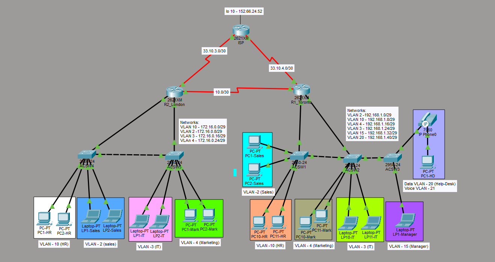

# CCNA Multi-Site Enterprise Network



## Project overview

This Cisco Packet Tracer project represents a small enterprise with **Toronto** and **London** sites. I built it to apply the CCNA topics I have studied so far: VLANs, 802.1Q trunking, router-on-a-stick, IPv4 subnetting, router-based DHCP, single-area OSPF, default routing, and PAT.

The project also records two real troubleshooting scenarios:

1. Clients received APIPA addresses because VLANs were not present across the complete Layer 2 trunk path.
2. Internal clients could not reach the simulated internet because the PAT overload rule was missing.

> **Scope:** This is an educational lab. Each site runs its own DHCP service; DHCP is not centralized between sites. OSPF operates only in Area 0.

## Skills demonstrated

- IPv4 subnetting with "/29" LANs and "/30" point-to-point links
- VLAN creation and access-port assignment
- 802.1Q trunks and VLAN propagation across switches
- Router-on-a-stick (ROAS) and inter-VLAN routing
- Router-based DHCP pools, exclusions, gateways, and DNS options
- Single-area OSPF and manual router IDs
- OSPF passive interfaces on user-facing VLANs
- Static default routes toward a simulated ISP
- PAT using NAT inside/outside interfaces and an ACL
- Data and voice VLAN separation
- Structured troubleshooting with Cisco IOS verification commands
- Basic device hardening: enable secret, password encryption, and disabled CDP

## Logical design

| Component | Role |
|---|---|
| R1_Toronto | Toronto inter-VLAN routing, DHCP, OSPF, and PAT edge |
| R2_London | London inter-VLAN routing, DHCP, OSPF, and PAT edge |
| ISP | Simulated internet with a loopback test destination |
| ACSW1–ACSW3 | Toronto access and trunk switching |
| ACSW4–ACSW5 | London access and trunk switching |
| "10.0.0.0/30" | Private R1–R2 WAN running OSPF Area 0 |
| ISP-facing links | Outside/PAT paths |

Inter-site private traffic follows the R1–R2 OSPF path and is not translated. Internet-bound traffic exits each site's ISP-facing interface and is translated with PAT.

## Addressing plan

### London

| VLAN | Department | Network | Gateway |
|---:|---|---|---|
| 10 | HR | "172.16.0.0/29" | "172.16.0.1" |
| 2 | Sales | "172.16.0.8/29" | "172.16.0.9" |
| 3 | IT | "172.16.0.16/29" | "172.16.0.17" |
| 4 | Marketing | "172.16.0.24/29" | "172.16.0.25" |

### Toronto

| VLAN | Department | Network | Gateway |
|---:|---|---|---|
| 2 | Sales | "192.168.1.0/29" | "192.168.1.1" |
| 10 | HR | "192.168.1.8/29" | "192.168.1.9" |
| 4 | Marketing | "192.168.1.16/29" | "192.168.1.17" |
| 3 | IT | "192.168.1.24/29" | "192.168.1.25" |
| 15 | Management | "192.168.1.32/29" | "192.168.1.33" |
| 20 | Help Desk | "192.168.1.40/29" | "192.168.1.41" |
| 21 | Voice | Voice VLAN | Lab-specific phone addressing |

### WAN

| Link | Network |
|---|---|
| R1–R2 private WAN | "10.0.0.0/30" |
| R2–ISP | "33.10.3.0/30" |
| R1–ISP | "33.10.4.0/30" |
| ISP test loopback | "152.66.24.52/32" |

> The ISP addresses above reflect the as-built Packet Tracer file. For future published labs, I would use RFC documentation ranges such as "198.51.100.0/24" and "203.0.113.0/24" rather than arbitrary public-looking addresses.

## Key configurations

### Router-on-a-stick

```cisco
interface FastEthernet0/0.2
 encapsulation dot1Q 2
 ip address 192.168.1.1 255.255.255.248
 ip nat inside
```

### DHCP

```cisco
ip dhcp excluded-address 192.168.1.1

ip dhcp pool VLAN2_Sales
 network 192.168.1.0 255.255.255.248
 default-router 192.168.1.1
 dns-server 8.8.8.8
```

### OSPF

```cisco
router ospf 1
 router-id 1.1.1.1
 passive-interface FastEthernet0/0.2
 passive-interface FastEthernet0/0.10
 network 10.0.0.0 0.0.0.3 area 0
```

### PAT

```cisco
access-list 1 permit 192.168.1.0 0.0.0.63
ip nat inside source list 1 interface Serial0/1 overload
ip route 0.0.0.0 0.0.0.0 Serial0/1
```

## Troubleshooting highlights

### APIPA on VLAN clients

The DHCP pools and router subinterfaces were correct, but DHCP Discover frames did not reach the router. "show vlan brief" and "show interfaces trunk" revealed that switches only had their locally used VLANs in their VLAN databases. Creating every required transit VLAN on the relevant switches restored the Layer 2 path and DHCP service.

[Read the case study](troubleshooting/01-apipa-vlan-path.md).

### PAT table remained empty

Clients could reach their gateways and the router's outside address, but not the ISP. "show ip nat translations" returned no entries. The NAT inside/outside markings and ACL were present, but the overload rule tying them together was missing. Adding it restored translated connectivity.

[Read the case study](troubleshooting/02-missing-pat-rule.md).

## Verification

Important commands used in the lab:

```cisco
show vlan brief
show interfaces trunk
show ip interface brief
show ip dhcp pool
show ip dhcp binding
show ip ospf neighbor
show ip route
show access-lists
show ip nat translations
show ip nat statistics
```

See the [verification checklist](https://github.com/arpan3a/ccna-multisite-enterprise-network/tree/main/verification).


## Learning outcomes

This lab taught me to troubleshoot from the symptom toward the responsible layer instead of changing multiple configurations at once. An APIPA symptom can originate from a broken VLAN path, while an internet-routing symptom can result from an incomplete NAT rule even when interface addressing and default routes appear correct.

## Future enhancements

I will extend the project only after studying the corresponding topics. Possible additions include ACL policy, port security, DHCP snooping, STP tuning, EtherChannel, SSH management, and IPv6.

## Disclaimer

This repository is for CCNA learning in Cisco Packet Tracer. 
